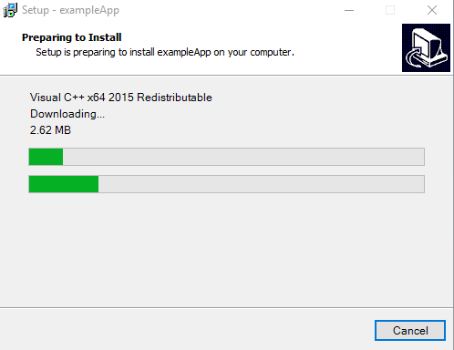

# ISX : InnoSetup eXtension

This Project is an extension to [Inno Setup](http://www.jrsoftware.org/isinfo.php)

# What is Inno Setup ?


[Inno Setup](http://www.jrsoftware.org/isinfo.php) is very popular free installer for Windows programs.

It's free even for commercial use, source code can be found [--> here](https://github.com/jrsoftware/issrc), and docs [--> here](http://www.jrsoftware.org/ishelp/)

First introduced in 1997 By Jordan Russell and Martijn Laan, It's funny to see that the scripting language used is still [Pascal](http://wiki.freepascal.org) and works perfectly !

# What is this eXtension ?

Is technically just a set of [APIs](docs/API.md) to extends InnoSetup native functionnalities, like:

- WebService REST API
- Json support
- Semver versionning
- Download (`ISX_AddDownloadTask`)
- Proper Windows's subprocess Execution and Cancellation (`ISX_AddExecuteTask`)
- Zip Extraction (`ISX_AddUnZipTask`)
- Safe Folder Deletion (`ISX_AddDeleteTask`)

See the full list of [provided APIs here](docs/API.md)

Some *.iss samples are [available here](samples/)

A subsequent feature provided here is a way to easily deal with third parties/dependencies.

# Deals with dependencies



Each requiered dependency (or so named **Product**) can be described thought a set of **Tasks**

Here is a simple example where we `[download + install]` 2 dependencies:

```pascal
// Initialize this extension
ISX_InitializeSetup();
```

```pascal
// Make sure that the list of products is empty
ISX_ClearProducts();

// Add 'Visual C++ x64 2015 Redistributable'
i := ISX_CreateProduct('Visual C++ x64 2015 Redistributable');
// - Which first need to download a binary
ISX_AddDownloadTask(i, 'http://download.microsoft.com/.../vc_redist.x64.exe', ExpandConstant('{tmp}/vc_redist.x64.exe'));
// - And then execute it
ISX_AddExecuteTask(i, ExpandConstant('{tmp}'), 'vc_redist.x64.exe', '/norestart');

// Add 'Another Product'
i := ISX_CreateProduct('Another Product');
// - Which first need to download a ZIP file
ISX_AddDownloadTask(i, 'http://domain/getzip', ExpandConstant('{tmp}/file.zip'));
// - And Extract it in a certain folder
ISX_AddUnZipTask(i, ExpandConstant('{tmp}/file.zip'), ExpandConstant('{app}/foo'), True);
```

```pascal
// Perform the described Tasks above
Result := ISX_Run();
```

```pascal
// End
ISX_Terminate();
```

# Motivation

If you want to deals with project's dependencies in InnoSetup, it's acutally possible without this extension, but:
1. you will have to write a lot of code by your own. 
2. you may meet some technicals limitations
3. Thinking about maintainability, [Pascal](http://wiki.freepascal.org) is clearly not the TOP10 language known.

That's not the first time that an InnoSetup extension is made, [Here](http://www.jrsoftware.org/is3rdparty.php) is a list of InnoSetup extension available

Mine have been originally inspired by [Inno Setup Dependency Installer](https://github.com/stfx/innodependencyinstaller) project

Which works great, until, I realize that it don't fits my requierements.

Here are the Drawbacks, that motivate me to create my own version:
- Some features was missing, like dealing with Webservices, JSON, Semver
- The Provided [isxdl.dll](https://github.com/stfx/innodependencyinstaller/blob/master/scripts/isxdl/isxdl.dll) is sent as a binary, with no way to recompile it
- There is still a lot of additionnal pascal code
- For UI in particular, I would prefere to rely that to C++
- They don't provide a way to have a UI during the Uninstall step.

# Ready to use it ?

Some *.iss samples are [available here](samples/)

# Specifications

- MIT License
- source code: C++ (visual studio 2015/2017)
- Tested on fresh/clean windows 7 and 10
